/**
@mainpage
# Peer-to-Peer Chat – Dokumentation

## 1. Projektüberblick
Ein dezentraler Chat-Client im lokalen Netzwerk, der Text- und Bildnachrichten ohne zentralen Server ermöglicht.  
Hauptfunktionen: Peer Discovery, Text- und Bildübertragung, Kommandozeilen-Bedienung (CLI), automatische Nutzererkennung.

---

## 2. Architektur

Das System ist modular aufgebaut und besteht aus folgenden Hauptkomponenten:

- **Interface (CLI):** Stellt die Kommandozeilen-Bedienung bereit. Nutzer gibt hier Befehle wie `/msg`, `/img`, `/who` usw. ein. Das Interface leitet die Befehle an den Messenger weiter und zeigt empfangene Nachrichten und Bilder an.
- **Messenger:** Übernimmt die Netzwerkkommunikation. Sendet und empfängt Nachrichten sowie Bilder über UDP/TCP. Kommuniziert direkt mit Interface, DiscoveryService und nutzt das Protocol-Modul zum Kodieren/Dekodieren der Nachrichten.
- **Protocol:** Stellt Funktionen zum Kodieren und Parsen des SLCP-Protokolls bereit (JOIN, MSG, IMG etc.).
- **DiscoveryService:** Verantwortlich für Peer-Discovery im lokalen Netzwerk mittels UDP-Broadcasts (JOIN, WHO, LEAVE, KNOWNUSERS). Pflegt eine aktuelle Liste bekannter Teilnehmer.
- **Config:** Verwaltet alle Einstellungen (wie Benutzername, Port, Bildverzeichnis) über eine TOML-Datei. Wird von Messenger und DiscoveryService geladen.
- **main.py:** Startet und verbindet alle Komponenten.

Das Zusammenspiel der Komponenten ist im folgenden Architekturdiagramm dargestellt:
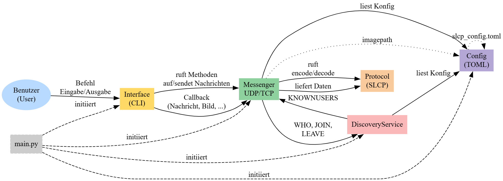

---

## 3. Verwendete Technologien & Tools

- **Programmiersprache:** Python 3.10+
- **Libraries:** socket, threading, asyncio, toml, colorama
- **Doxygen:** für technische Dokumentation (HTML, PDF)
- **Git:** für Versionierung (GitHub)
- **Konfigurationsdatei:** TOML-Format (slcp_config.toml)
- **Entwicklungsumgebung:** PyCharm

---

## 4. Protokollübersicht (SLCP)

Textbasierte Kommandos im Simple Local Chat Protocol:

| Befehl      | Parameter         | Beschreibung                           |
| ----------- |-------------------| -------------------------------------- |
| JOIN        | `<Handle> <Port>` | Tritt dem Chat bei                     |
| LEAVE       | `<Handle>`        | Verlässt den Chat                      |
| MSG         | `<Handle> <Text>` | Sendet Nachricht an Nutzer             |
| IMG         | `<Handle> <Size>` | Bildübertragung starten                |
| WHO         | -                 | Fragt bekannte Nutzer ab               |
| KNOWNUSERS  | `<Liste>`         | Antwort mit bekannten Nutzern          |

---

### 4.1 Ablauf beim Anmelden im Chat

Im Folgenden wird gezeigt, wie ein Nutzer dem Chat beitritt:

1. **Alice** gibt im Interface den Befehl /join ein.
2. **Das Interface** ruft im Messenger die Funktion zum Beitreten auf.
3. **Der Messenger** veranlasst den Discovery-Service, eine JOIN Alice <Port>-Nachricht per UDP-Broadcast im lokalen Netzwerk zu senden.
4. **Alle Discovery-Services** der anderen Peers empfangen die JOIN-Nachricht und nehmen Alice in ihre Peer-Liste auf.
5. **Alice** ist jetzt als aktiver Teilnehmer im Chat-Netzwerk bekannt.

Der Ablauf ist im folgenden Diagramm dargestellt:


---

### 4.2 Ablauf beim Abmelden aus dem Chat

Im Folgenden wird gezeigt, wie ein Nutzer den Chat verlässt:

1. **Alice** gibt im Interface den Befehl /leave ein.
2. **Das Interface** ruft im Messenger die Funktion zum Verlassen des Chats auf.
3. **Der Messenger** veranlasst den Discovery-Service, eine LEAVE Alice-Nachricht per UDP-Broadcast im lokalen Netzwerk zu senden.
4. **Alle Discovery-Services** der anderen Peers empfangen die LEAVE-Nachricht und entfernen Alice aus ihrer Peer-Liste.
5. **Alice** wird aus dem Netzwerk entfernt und erscheint nicht mehr als aktiver Teilnehmer.

Der Ablauf ist im folgenden Diagramm dargestellt:
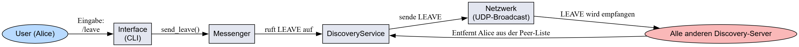

---

### 4.3 Ablauf beim Abfragen und Empfangen der Nutzerliste

Im Folgenden wird gezeigt, wie die Liste aller aktiven Nutzer im Chat abgefragt wird:

1. **Bob** gibt im Interface den Befehl /who ein.
2. **Das Interface** ruft im Messenger die Funktion zum Senden einer WHO-Anfrage auf.
3. **Der Messenger** veranlasst den Discovery-Service, eine WHO-Nachricht per UDP-Broadcast an alle Discovery-Services im lokalen Netzwerk zu senden.
4. **Jeder Discovery-Service** (bei allen aktiven Peers) empfängt die WHO-Anfrage und antwortet per Unicast mit einer eigenen KNOWNUSERS-Nachricht, die alle aktuell bekannten Nutzer (Handle, IP, Port) enthält.
5. **Der Messenger von Bob** empfängt eine oder mehrere KNOWNUSERS-Antworten, konsolidiert die Einträge (entfernt ggf. Duplikate) und aktualisiert seine interne Peer-Liste.
6. **Das Interface bei Bob** zeigt daraufhin die vollständige Liste aller aktuell erreichbaren Nutzer im Terminal an.

Der Ablauf ist im folgenden Diagramm dargestellt:
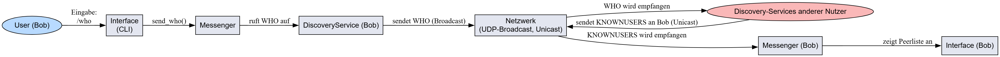

---

### 4.4 Ablauf beim Senden einer Textnachricht

Im Folgenden wird gezeigt, wie ein Bild vom Nutzer „Alice“ an „Bob“ gesendet wird:

1. **Alice** gibt im Interface den Befehl /msg Bob Hallo Bob! ein.
2. **Das Interface** ruft im Messenger die Funktion zum Senden einer Nachricht auf.
3. **Der Messenger** ermittelt die Netzwerkadresse von Bob und sendet den SLCP-Befehl MSG Bob "Hallo Bob!" per UDP direkt an Bobs Peer-Adresse.
4. **Bob's Messenger** empfängt die Nachricht, prüft den Befehl und übergibt den Text an das lokale Interface.
5. **Das Interface bei Bob** zeigt die empfangene Nachricht sofort im Terminal an.

Der Ablauf ist im folgenden Diagramm dargestellt:
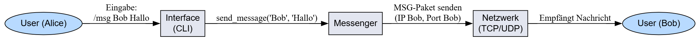

---

### 4.5 Ablauf beim Senden eines Bildes

Im Folgenden wird gezeigt, wie ein Bild vom Nutzer „Alice“ an „Bob“ gesendet wird:

1. **Alice** gibt im Interface den Befehl `/img Bob pfad/zum/bild.jpg` ein.
2. **Das Interface** ruft im Messenger die Funktion zum Senden eines Bildes auf.
3. **Der Messenger** öffnet eine TCP-Verbindung zum Peer (Bob), sendet den SLCP-Befehl `IMG Bob <Größe>`, danach die Bilddaten als Bytestream.
4. **Bob's Messenger** nimmt die Verbindung entgegen, liest Befehl und Daten und speichert das Bild im vorgegebenen Ordner.
5. **Das Interface bei Bob** zeigt eine Benachrichtigung über das empfangene Bild an.

Der Ablauf ist im folgenden Diagramm dargestellt:
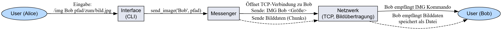

---

### 4.6 Ausgabe-Beispiel

Im Folgenden einige Screenshots der CLI-Anwendung:


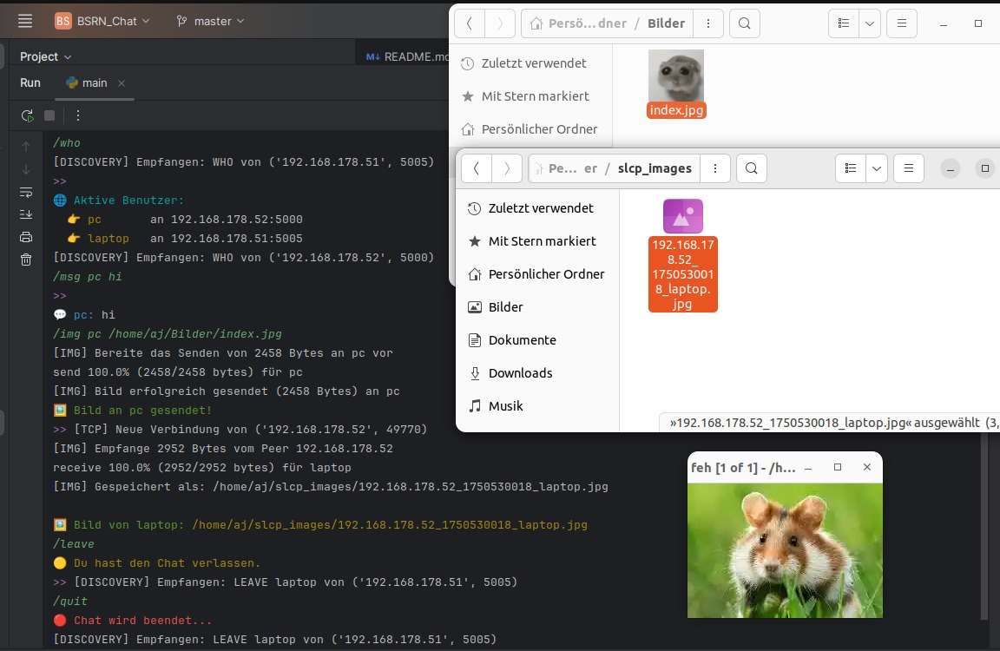

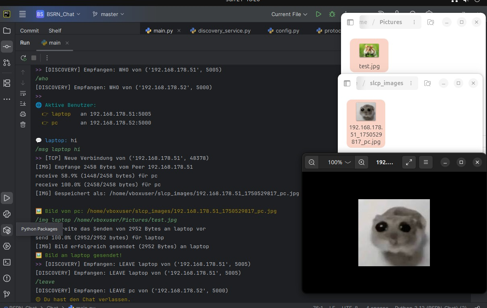

---

## 5. Teilprobleme und Lösungsansätze (Fehleranalyse)

Im Folgenden werden typische Fehler und ihre Lösungen im Projekt erläutert.  
Jedes Beispiel enthält einen Screenshot sowie eine kurze Analyse und die jeweilige Korrektur.

---

### 5.1 IndexError beim Parsen von Benutzerdaten

Beim Parsen von "KNOWNUSERS"-Nachrichten wurde nicht geprüft, ob die Liste drei Einträge enthält. Das führte zu einem IndexError bei fehlerhaften Daten.

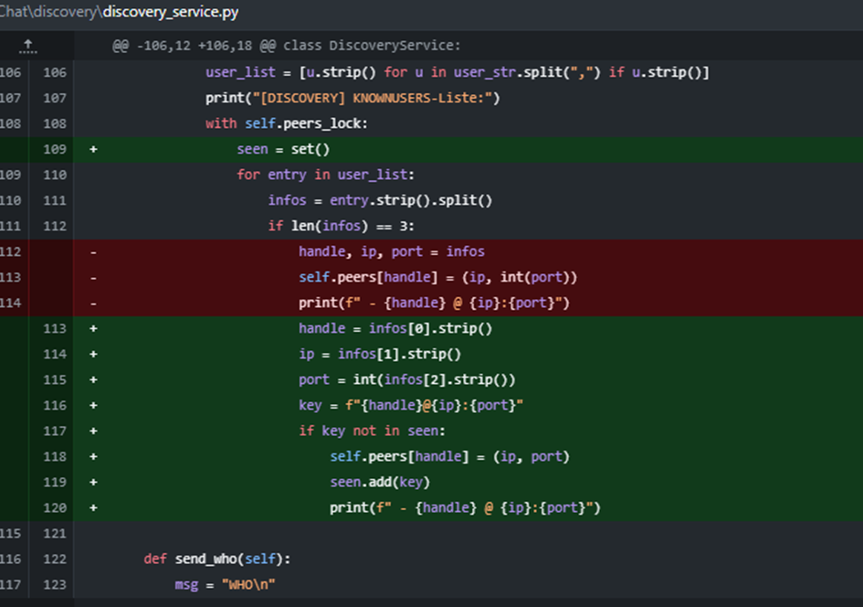

> **Lösung:**  
> Durch die zusätzliche Prüfung `if len(infos) == 3` werden nur gültige Einträge verarbeitet – Abstürze werden verhindert.

---

### 5.2 Relativer Bildpfad und Ordnerprüfung

Bildpfade wurden ursprünglich relativ angegeben (`"./images"`), ohne zu prüfen, ob das Verzeichnis existiert. Das konnte zu Speicherfehlern führen.


> **Lösung:**  
> Mit `_setup_imagepath()` wird ein absoluter, robuster Pfad erzeugt und der Zielordner automatisch angelegt.

---

### 5.3 Konsistente CLI-Befehle und Hilfeanzeige

Der Befehl `/send` wurde zu `/msg` geändert, alle Hilfetexte und Argumentbeschreibungen wurden vereinheitlicht.

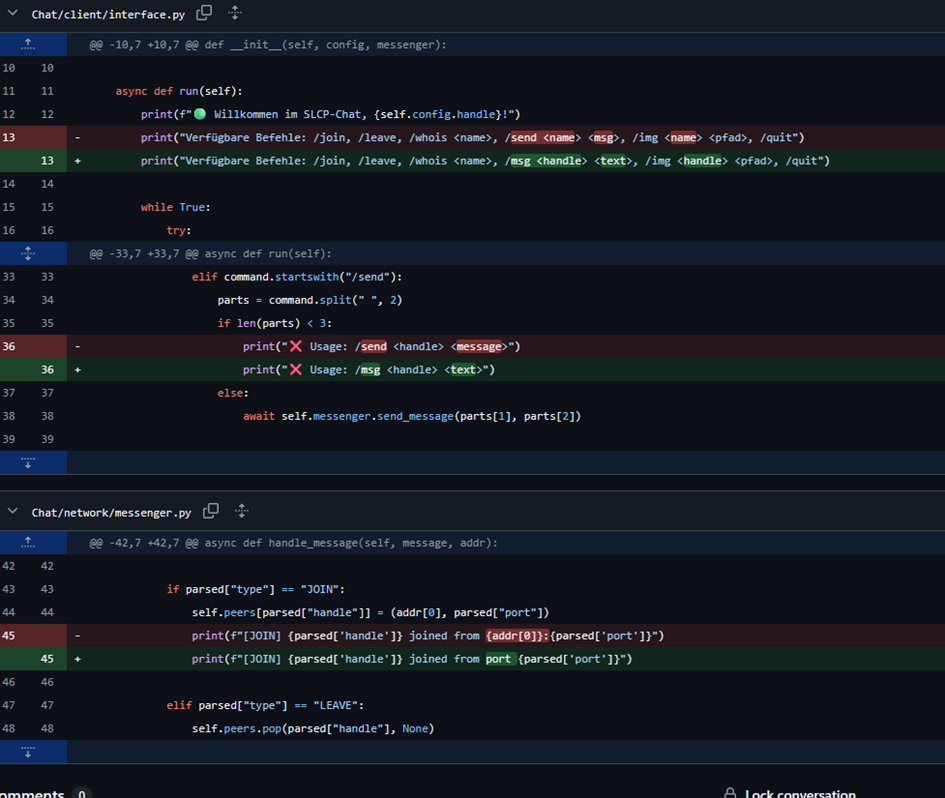

> **Lösung:**  
> Einheitliche Befehle und Hilfe reduzieren Fehler und verbessern die Usability.

---

### 5.4 Flexibler Umgang mit Peer-Daten (JOIN/KNOWNUSERS)

Die Peer-Liste wurde flexibler gestaltet, doppelte oder eigene Einträge werden gezielt behandelt.

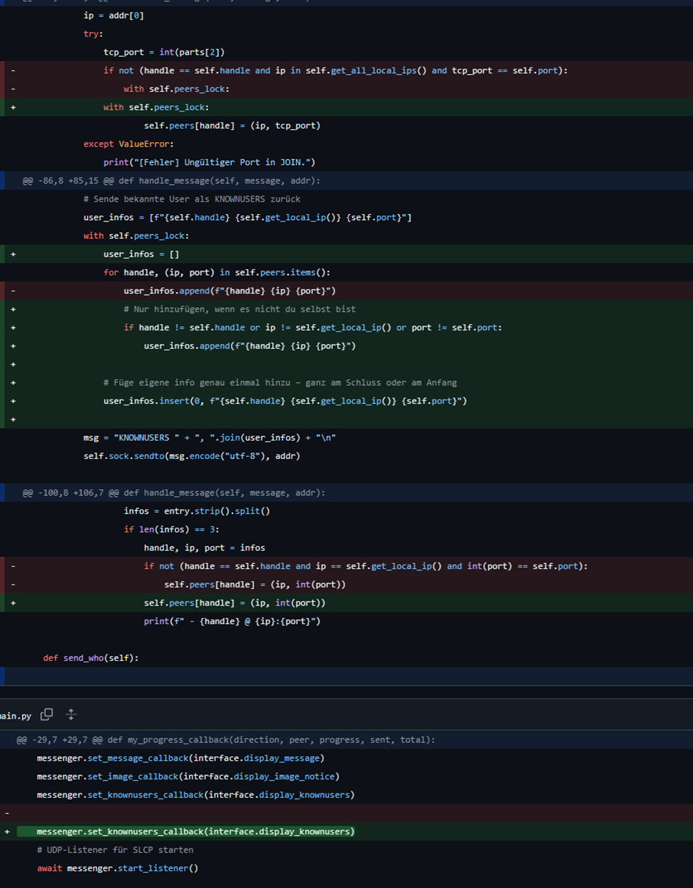

> **Lösung:**  
> Einträge werden gesammelt, die eigene Instanz wird einmalig am Ende hinzugefügt – die Peer-Liste ist vollständiger und übersichtlicher.

---

### 5.5 Konsolidierung mehrerer KNOWNUSERS-Antworten

Mehrere gleichzeitige KNOWNUSERS-Antworten konnten früher verloren gehen.

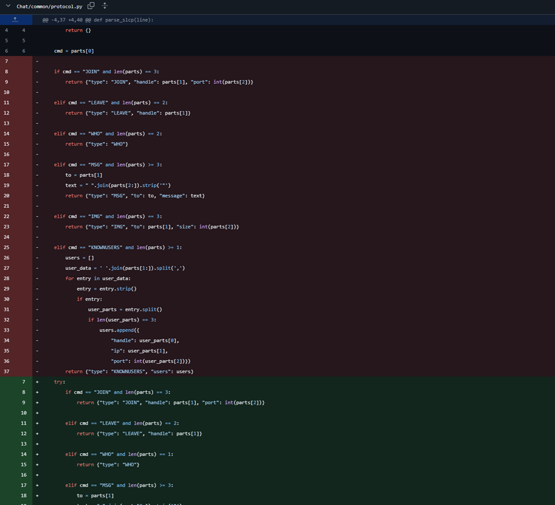
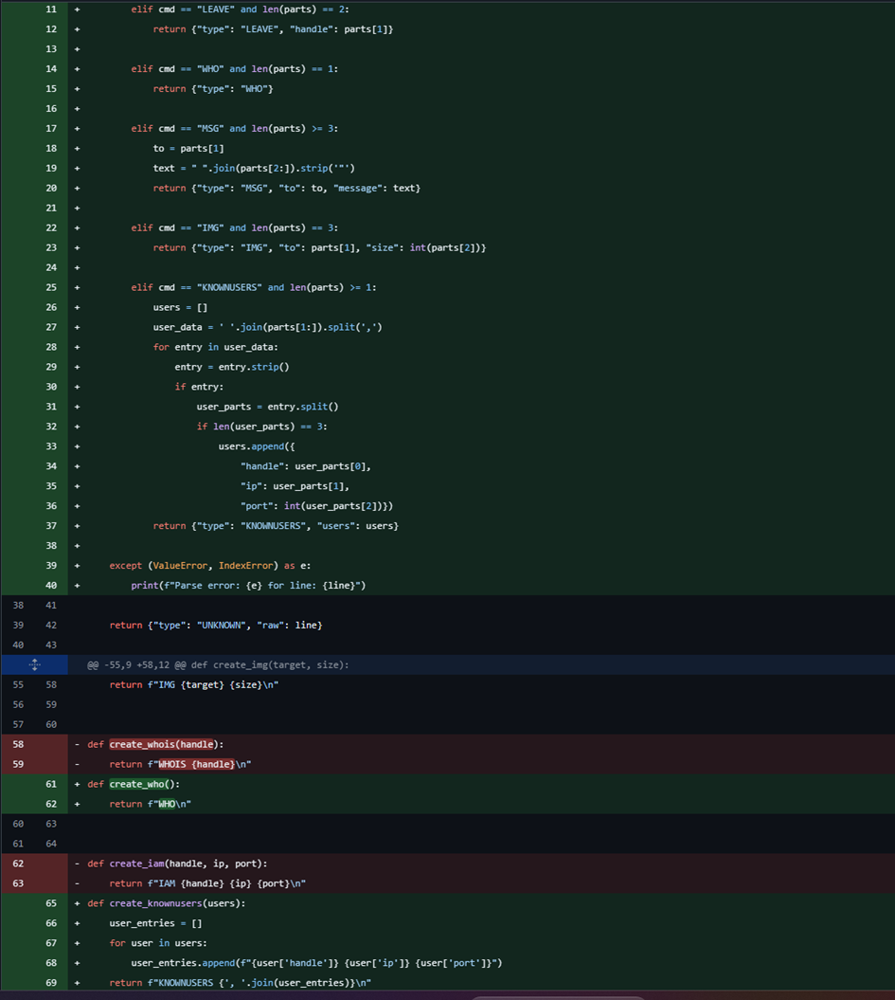

> **Lösung:**  
> Die Funktion `handle_knownusers_response` sammelt und konsolidiert nun alle Antworten mit Timeout.

---

### 5.6 Verbesserte Anzeige des Absenders

Statt nur der IP-Adresse wird nun – sofern bekannt – immer der Benutzername angezeigt.

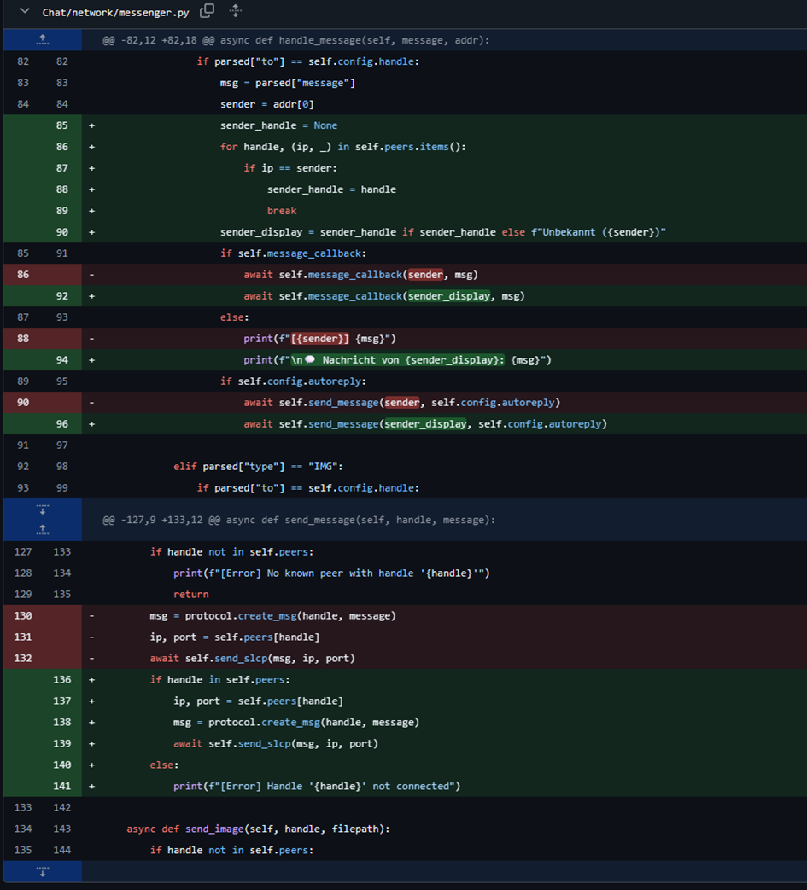

> **Lösung:**  
> Der Anzeigename (Handle) wird bevorzugt gezeigt; ansonsten erscheint “Unbekannt”.

---

### 5.7 Doppelte Einträge in WHO/KNOWNUSERS-Liste

Doppelte Einträge in der Peer-Liste wurden entfernt.

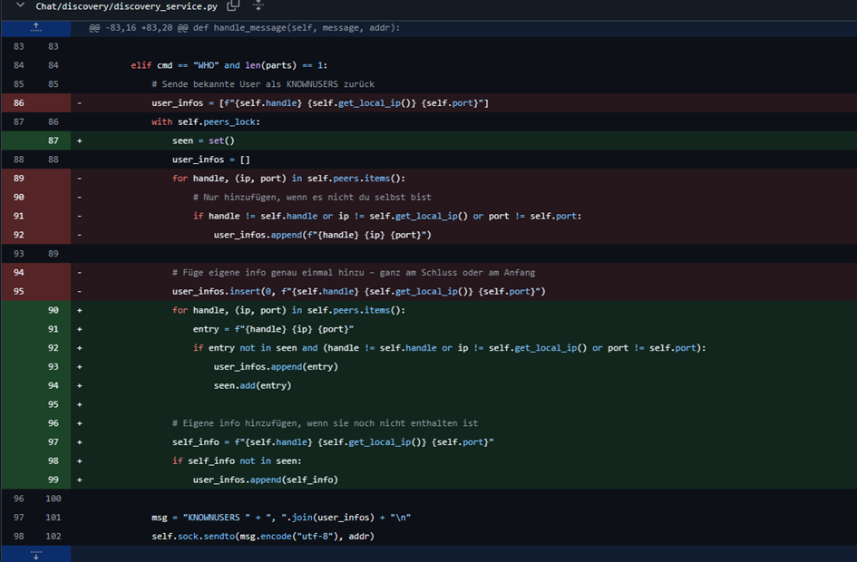

> **Lösung:**  
> Mit einer seen-Menge werden Einträge geprüft, und Duplikate gezielt vermieden.

---

**Weitere Details und vollständige Screenshots siehe:**  
[Screenshots mit Fehleranalyse](docs/Screenshots%20mit%20Fehleranalyse%20final.odt)

---

## 6. Bedienung

- **Start:**  
  ```bash
  python main.py
