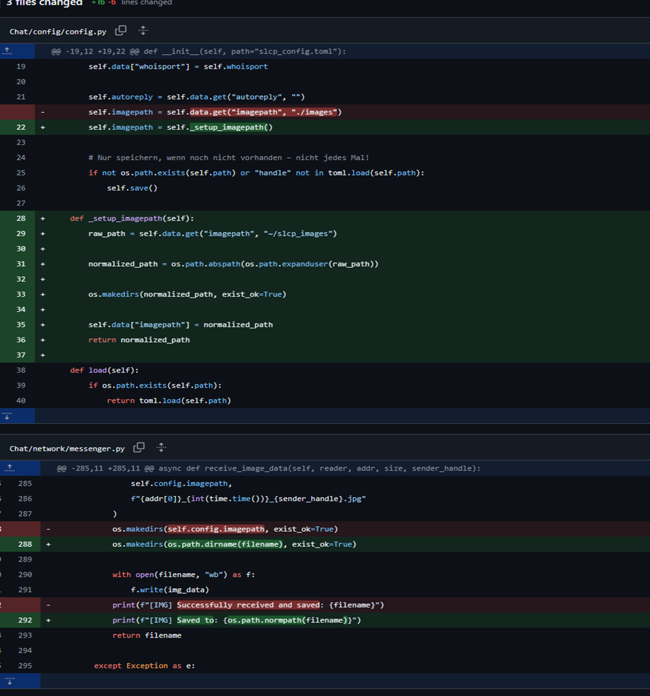

/**
@mainpage
# Peer-to-Peer Chat – Dokumentation

## 1. Projektüberblick
Ein dezentraler Chat-Client im lokalen Netzwerk, der Text- und Bildnachrichten ohne zentralen Server ermöglicht.  
Hauptfunktionen: Peer Discovery, Text- und Bildübertragung, Kommandozeilen-Bedienung (CLI), automatische Nutzererkennung.

---

## 2. Architektur

Das System ist modular aufgebaut und besteht aus folgenden Hauptkomponenten:

- **Interface (CLI):** Stellt die Kommandozeilen-Bedienung bereit. Nutzer gibt hier Befehle wie `/msg`, `/img`, `/who` usw. ein. Das Interface leitet die Befehle an den Messenger weiter und zeigt empfangene Nachrichten und Bilder an.
- **Messenger:** Übernimmt die Netzwerkkommunikation. Sendet und empfängt Nachrichten sowie Bilder über UDP/TCP. Kommuniziert direkt mit Interface, DiscoveryService und nutzt das Protocol-Modul zum Kodieren/Dekodieren der Nachrichten.
- **Protocol:** Stellt Funktionen zum Kodieren und Parsen des SLCP-Protokolls bereit (JOIN, MSG, IMG etc.).
- **DiscoveryService:** Verantwortlich für Peer-Discovery im lokalen Netzwerk mittels UDP-Broadcasts (JOIN, WHO, LEAVE, KNOWNUSERS). Pflegt eine aktuelle Liste bekannter Teilnehmer.
- **Config:** Verwaltet alle Einstellungen (wie Benutzername, Port, Bildverzeichnis) über eine TOML-Datei. Wird von Messenger und DiscoveryService geladen.
- **main.py:** Startet und verbindet alle Komponenten.

Das Zusammenspiel der Komponenten ist im folgenden Architekturdiagramm dargestellt:


---

## 3. Verwendete Technologien & Tools

- **Programmiersprache:** Python 3.10+
- **Libraries:** socket, threading, asyncio, toml, colorama
- **Doxygen:** für technische Dokumentation (HTML, PDF)
- **Git:** für Versionierung (GitHub)
- **Konfigurationsdatei:** TOML-Format (slcp_config.toml)
- **Entwicklungsumgebung:** PyCharm

---

## 4. Protokollübersicht (SLCP)

Textbasierte Kommandos im Simple Local Chat Protocol:

| Befehl      | Parameter         | Beschreibung                           |
| ----------- |-------------------| -------------------------------------- |
| JOIN        | `<Handle> <Port>` | Tritt dem Chat bei                     |
| LEAVE       | `<Handle>`        | Verlässt den Chat                      |
| MSG         | `<Handle> <Text>` | Sendet Nachricht an Nutzer             |
| IMG         | `<Handle> <Size>` | Bildübertragung starten                |
| WHO         | -                 | Fragt bekannte Nutzer ab               |
| KNOWNUSERS  | `<Liste>`         | Antwort mit bekannten Nutzern          |

---

### 4.1 Ablauf beim Anmelden im Chat

Im Folgenden wird gezeigt, wie ein Nutzer dem Chat beitritt:

1. **Alice** gibt im Interface den Befehl /join ein.
2. **Das Interface** ruft im Messenger die Funktion zum Beitreten auf.
3. **Der Messenger** veranlasst den Discovery-Service, eine JOIN Alice <Port>-Nachricht per UDP-Broadcast im lokalen Netzwerk zu senden.
4. **Alle Discovery-Services** der anderen Peers empfangen die JOIN-Nachricht und nehmen Alice in ihre Peer-Liste auf.
5. **Alice** ist jetzt als aktiver Teilnehmer im Chat-Netzwerk bekannt.

Der Ablauf ist im folgenden Diagramm dargestellt:


---

### 4.2 Ablauf beim Abmelden aus dem Chat

Im Folgenden wird gezeigt, wie ein Nutzer den Chat verlässt:

1. **Alice** gibt im Interface den Befehl /leave ein.
2. **Das Interface** ruft im Messenger die Funktion zum Verlassen des Chats auf.
3. **Der Messenger** veranlasst den Discovery-Service, eine LEAVE Alice-Nachricht per UDP-Broadcast im lokalen Netzwerk zu senden.
4. **Alle Discovery-Services** der anderen Peers empfangen die LEAVE-Nachricht und entfernen Alice aus ihrer Peer-Liste.
5. **Alice** wird aus dem Netzwerk entfernt und erscheint nicht mehr als aktiver Teilnehmer.

Der Ablauf ist im folgenden Diagramm dargestellt:


---

### 4.3 Ablauf beim Abfragen und Empfangen der Nutzerliste

Im Folgenden wird gezeigt, wie die Liste aller aktiven Nutzer im Chat abgefragt wird:

1. **Bob** gibt im Interface den Befehl /who ein.
2. **Das Interface** ruft im Messenger die Funktion zum Senden einer WHO-Anfrage auf.
3. **Der Messenger** veranlasst den Discovery-Service, eine WHO-Nachricht per UDP-Broadcast an alle Discovery-Services im lokalen Netzwerk zu senden.
4. **Jeder Discovery-Service** (bei allen aktiven Peers) empfängt die WHO-Anfrage und antwortet per Unicast mit einer eigenen KNOWNUSERS-Nachricht, die alle aktuell bekannten Nutzer (Handle, IP, Port) enthält.
5. **Der Messenger von Bob** empfängt eine oder mehrere KNOWNUSERS-Antworten, konsolidiert die Einträge (entfernt ggf. Duplikate) und aktualisiert seine interne Peer-Liste.
6. **Das Interface bei Bob** zeigt daraufhin die vollständige Liste aller aktuell erreichbaren Nutzer im Terminal an.

Der Ablauf ist im folgenden Diagramm dargestellt:


---

### 4.4 Ablauf beim Senden einer Textnachricht

Im Folgenden wird gezeigt, wie ein Bild vom Nutzer „Alice“ an „Bob“ gesendet wird:

1. **Alice** gibt im Interface den Befehl /msg Bob Hallo Bob! ein.
2. **Das Interface** ruft im Messenger die Funktion zum Senden einer Nachricht auf.
3. **Der Messenger** ermittelt die Netzwerkadresse von Bob und sendet den SLCP-Befehl MSG Bob "Hallo Bob!" per UDP direkt an Bobs Peer-Adresse.
4. **Bob's Messenger** empfängt die Nachricht, prüft den Befehl und übergibt den Text an das lokale Interface.
5. **Das Interface bei Bob** zeigt die empfangene Nachricht sofort im Terminal an.

Der Ablauf ist im folgenden Diagramm dargestellt:


---

### 4.5 Ablauf beim Senden eines Bildes

Im Folgenden wird gezeigt, wie ein Bild vom Nutzer „Alice“ an „Bob“ gesendet wird:

1. **Alice** gibt im Interface den Befehl `/img Bob pfad/zum/bild.jpg` ein.
2. **Das Interface** ruft im Messenger die Funktion zum Senden eines Bildes auf.
3. **Der Messenger** öffnet eine TCP-Verbindung zum Peer (Bob), sendet den SLCP-Befehl `IMG Bob <Größe>`, danach die Bilddaten als Bytestream.
4. **Bob's Messenger** nimmt die Verbindung entgegen, liest Befehl und Daten und speichert das Bild im vorgegebenen Ordner.
5. **Das Interface bei Bob** zeigt eine Benachrichtigung über das empfangene Bild an.

Der Ablauf ist im folgenden Diagramm dargestellt:


---

### 4.6 Ausgabe-Beispiel

Im Folgenden einige Screenshots der CLI-Anwendung:


---

## 5. Teilprobleme und Lösungsansätze (Fehleranalyse)

Im Folgenden werden typische Fehler und ihre Lösungen im Projekt erläutert.  
Jedes Beispiel enthält einen Screenshot sowie eine kurze Analyse und die jeweilige Korrektur.

---

### 5.1 IndexError beim Parsen von Benutzerdaten

Beim Parsen der „KNOWNUSERS“-Nachricht wurde die empfangene Zeichenkette mit `info.split()` zerlegt, ohne zu prüfen, ob wirklich drei Felder (`Handle`, `IP`, `Port`) vorliegen. Wenn ein Netzwerkpaket fehlformatiert war (z. B. zu wenige Einträge enthielt), wurde auf ein nicht vorhandenes Element zugegriffen – das führte zu einem IndexError. Dieser Fehler trat insbesondere bei Netzwerkproblemen oder inkompatiblen Peers auf und konnte das ganze Programm zum Absturz bringen.


> **Lösung:**  
> Jetzt wird vor dem Zugriff geprüft, ob `len(infos) == 3` gilt. So werden nur gültige Peer-Informationen akzeptiert und verarbeitet, wodurch Abstürze durch fehlerhafte Netzwerkdaten zuverlässig verhindert werden.

---

### 5.2 Relativer Bildpfad und Ordnerprüfung

Ursprünglich wurde als Speicherort für empfangene Bilder ein relativer Pfad (`"./images"`) verwendet. Das war problematisch, da das Verzeichnis je nach aktuellem Arbeitsverzeichnis unterschiedlich interpretiert werden kann und bei fehlender Erstellung Dateioperationen fehlschlugen. Das führte vor allem beim ersten Programmstart zu unerwarteten Fehlern beim Speichern von Bildern.



> **Lösung:**  
> Die Methode `_setup_imagepath()` wandelt den Bildpfad jetzt in einen absoluten, benutzerspezifischen Pfad (z. B. `~/slcp_images`) um und legt das Zielverzeichnis automatisch an. Dadurch werden Bilder plattformunabhängig und zuverlässig gespeichert.

---

### 5.3 Konsistente CLI-Befehle und Hilfeanzeige

Die Kommandozeilenschnittstelle (CLI) war zunächst inkonsistent gestaltet. Es gab sowohl den Befehl `/send` als auch `/msg` und die Argumentbeschreibungen waren unklar (z. B. `<message>` statt `<text>`). Das führte dazu, dass neue Benutzer die richtigen Befehle nicht immer sofort fanden und es zu Bedienungsfehlern kam.


> **Lösung:**  
> Alle Befehle und Hilfetexte wurden vereinheitlicht. Die CLI verwendet jetzt konsistente Benennungen wie `/msg` und eindeutige Argumente, was die Benutzung erleichtert und Missverständnisse minimiert.

---

### 5.4 Flexibler Umgang mit Peer-Daten (JOIN/KNOWNUSERS)

Bei der Verarbeitung von Peer-Informationen (insbesondere bei JOIN/KNOWNUSERS) wurden Einträge starr nach IP und Handle verglichen. Dadurch kam es gelegentlich zu unvollständigen oder doppelten Listen – etwa, wenn ein Nutzer mehrfach im Netzwerk auftauchte oder sich seine IP-Adresse änderte.


> **Lösung:**  
> Die neue Logik sammelt alle Peer-Daten und prüft erst nach dem Sammeln, ob Einträge tatsächlich zur eigenen Instanz gehören. Die eigene Information wird gezielt am Ende der Liste eingefügt, doppelte Einträge werden zuverlässig vermieden.

---

### 5.5 Konsolidierung mehrerer KNOWNUSERS-Antworten

Wenn eine WHO-Anfrage gestellt wurde, konnten mehrere „KNOWNUSERS“-Antworten fast gleichzeitig eintreffen. Der ursprüngliche Code verarbeitete jede Antwort einzeln, wodurch Informationen verloren gehen konnten, wenn Nachrichten schnell hintereinander empfangen wurden.


> **Lösung:**  
> Die neue Funktion `handle_knownusers_response` sammelt alle Antworten für eine kurze Zeit, konsolidiert die erhaltenen Daten und übergibt die vollständige Liste dann gesammelt an das Interface.

---

### 5.6 Verbesserte Anzeige des Absenders

Beim Anzeigen eingehender Nachrichten wurde bisher oft nur die rohe IP-Adresse des Absenders angezeigt, selbst wenn dessen Handle bekannt war. Das erschwerte die Zuordnung und war wenig benutzerfreundlich.


> **Lösung:**  
> Jetzt wird – sofern möglich – immer der Benutzername (Handle) angezeigt. Ist dieser nicht bekannt, erscheint stattdessen „Unbekannt“.

---

### 5.7 Doppelte Einträge in WHO/KNOWNUSERS-Liste

Die Peer-Liste enthielt manchmal doppelte Einträge, da bei jedem Empfang der eigenen Information diese erneut angehängt wurde. Das sorgte für Unübersichtlichkeit in der Nutzeranzeige.


> **Lösung:**  
> Mithilfe einer sogenannten „seen“-Menge werden doppelte Einträge beim Sammeln gezielt vermieden.

---

**Weitere Details und vollständige Screenshots siehe:**  
[Screenshots mit Fehleranalyse](docs/Screenshots%20mit%20Fehleranalyse%20final.odt)

---

## 6. Bedienung

- **Start:**  
  ```bash
  python main.py
